# PressurePilot: Real-Time Time-Series Forecasting

[](https://go.dev/)
[](https://www.docker.com/)
[](https://opensource.org/licenses/MIT)

A multi-container Go application that demonstrates a full-cycle, real-time data pipeline. This project simulates industrial sensor data, streams it into a PostgreSQL database, and serves it via a REST API to a live-updating web UI that includes a predictive forecast using Fourier analysis.

The project is designed to showcase a modern microservice architecture, containerization, data persistence, and CI/CD-ready design patterns.

-----

## 🏛️ System Architecture

This project follows a microservice pattern, with each component isolated in its own Docker container and managed by Docker Compose. This design ensures separation of concerns, scalability, and a portable deployment model.

```mermaid
graph TD
    subgraph "External User"
        U[👨‍💻 User's Browser]
    end

    subgraph "Docker Environment (on localhost)"
        A[▶️ Gin API Server <br> Service: server]
        G[📈 Data Generator <br> Service: generator]
        DB[(📦 PostgreSQL <br> Service: db)]

        A -- "Reads/Writes Data" --> DB
        G -- "Inserts Data" --> DB
    end

    U -- "Accesses UI & API via localhost:8080" --> A
    A -- "Serves HTML/JS & API Responses" --> U

    style U fill:#f9f,stroke:#333,stroke-width:2px
    style DB fill:#bbf,stroke:#333,stroke-width:2px
    style A fill:#d4fcd7,stroke:#333,stroke-width:2px
    style G fill:#fcf8d4,stroke:#333,stroke-width:2px
```



1.  **`db` (PostgreSQL)**: The stateful component. A standard `postgres:13` image that persists all time-series data. The schema is initialized on first run using the `init_db.sql` volume mount.
2.  **`generator` (Go)**: A headless microservice that simulates sensor readings. It connects to the database and inserts a new data point every 500ms.
3.  **`server` (Go & Gin)**: The user-facing microservice. It serves the static `index.html` frontend, exposes a REST API (`/api/readings`, `/api/predict`), and performs the forecast calculations.
4.  **Networking**: Services communicate on a shared Docker network. Only the `server`'s port `8080` and the `db`'s port `5432` are exposed to the host.

-----

## ✨ Key Concepts Demonstrated

  * **Containerization & Orchestration**: A multi-stage `Dockerfile` creates lean runtime images, while `docker-compose.yml` orchestrates the entire application stack for one-command deployment.
  * **Microservice Architecture**: Clear separation of concerns between the data generator, the API server, and the database.
  * **CI/CD Friendly**: The containerized environment makes the project portable and easy to integrate into any automated CI/CD pipeline.
  * **Data Modeling & Persistence**: A relational schema (`init_db.sql`) stores time-series data, and Go services interact with it safely using connection pooling (`pgxpool`).
  * **Backend Development (Go)**:
      * **API Serving**: A REST API built with the **Gin** web framework.
      * **Database Interaction**: Clean, efficient SQL queries using the `jackc/pgx` library.
      * **Concurrency**: The `generator` uses tickers for scheduled, non-blocking task execution.
  * **Frontend Development (Vanilla JS)**:
      * **Dynamic Visualization**: Interactive charts rendered with **Plotly.js**.
      * **Live Data**: The frontend continuously polls the API to create a real-time experience.
  * **Mathematical Modeling**: Practical application of numerical computing (**Gonum**) to generate Fourier series features and perform a linear regression for forecasting.

-----

## 🛠️ Technology Stack

| Category | Technology |
| :--- | :--- |
| **Backend** |   |
| **Database** |  |
| **Frontend** |   |
| **DevOps** |   |
| **Libraries** | `gonum/mat` (Linear Algebra), `jackc/pgx` (Postgres Driver), `plotly.js` (Charting) |

-----

## 🚀 Getting Started

### Prerequisites

  * [Docker](https://www.docker.com/products/docker-desktop/)
  * [Docker Compose](https://docs.docker.com/compose/install/) (Included with Docker Desktop)

### 1\. Clone & Launch

Clone the repository and use Docker Compose to build the images and start the services.

```bash
# Clone the repository
git clone https://github.com/MLegkovskis/PressurePilot.git

# Navigate into the project directory
cd PressurePilot

# Build and run all services in the background
docker-compose up --build -d
```

### 2\. Verify and Access

Check that all three containers are running:

```bash
docker-compose ps
```

You should see `db`, `generator`, and `server` with a status of `Up` or `Running`.

  * **View the UI**: Open your browser to **[http://localhost:8080](https://www.google.com/search?q=http://localhost:8080)**.
  * **Access the Database**: Connect to `localhost:5432` with user `user` and password `password`.

It may take a few seconds for the first data points to appear on the chart.

### 3\. Stop the Application

To stop and remove the containers, run:

```bash
docker-compose down
```

-----

## ⚙️ Configuration

Application behavior can be modified through environment variables in `docker-compose.yml` or constants in the source code.

| Parameter | Location | Description |
| :--- | :--- | :--- |
| **DB Connection** | `docker-compose.yml` (`PG_CONN`) | The DSN connection string used by the services. |
| **Generator Rate** | `cmd/generator/main.go` (`time.Ticker`) | The interval at which new data points are generated. |
| **Forecast Period** | `cmd/server/main.go` (`period`) | The assumed period of the primary cycle in the data. |
| **Harmonics** | `cmd/server/main.go` (`harmonics`) | The number of Fourier terms to use in the model. |

To apply changes made in the Go source code, you must rebuild the Docker images: `docker-compose up --build`.

-----

## 🔬 Development & Extension Ideas

  * **Implement a CI/CD Pipeline**: Add a `.github/workflows/ci.yml` to automatically build, test, and push the Docker images to a registry.
  * **Add Unit & Integration Tests**: Write Go tests for the `data` package functions and API endpoints to ensure correctness.
  * **Introduce Health Checks**: Implement a `/healthz` endpoint in the `server` and add a `healthcheck` instruction in the `docker-compose.yml`.
  * **Switch to WebSockets**: Replace the frontend's polling mechanism with a WebSocket connection for more efficient, push-based data updates.
